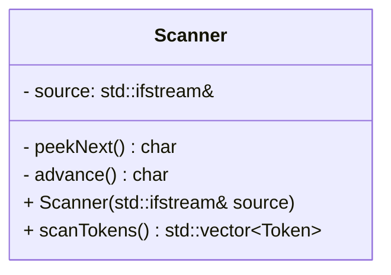
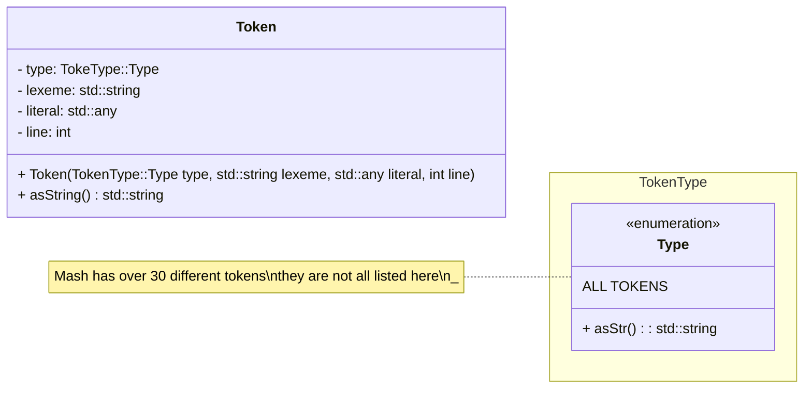
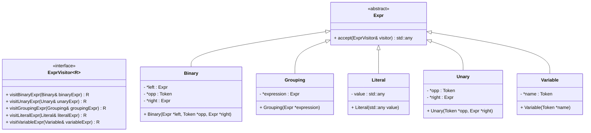
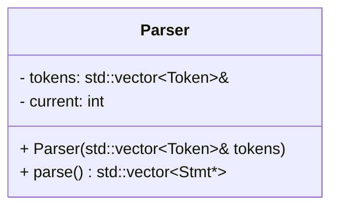
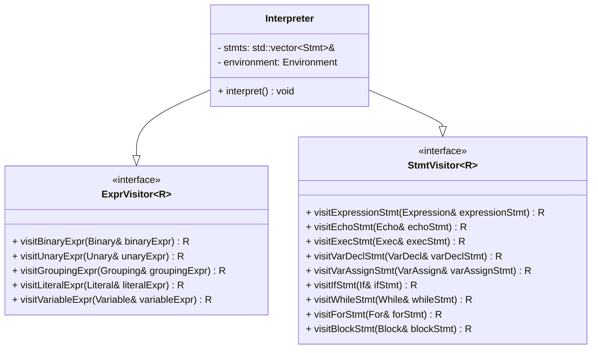
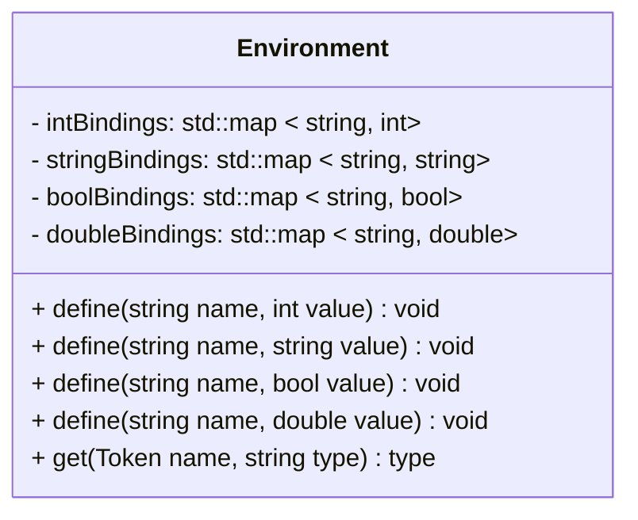

# Welcome to Mini Bash (Mash)!

# Problem Description

I have often found myself wanting to automate small tasks around my computer, however I have never really found an easy enough way to do this (to me at least) that I actually go about implementing the automations. For this project I wanted to try my hand at writing an interpreter for a small language of my own design. Specifically, a language that feels kind of like c++ or java, but that has built in functionality for executing commands in the terminal and interacting with the filesystem. While these things are possible in c++ and java, I also wanted my language to be a scripting language in order for it to be easier to use.

## An example program

The language I will design will be able to perform simple tasks such as the ones in the following example program

```cpp
// This program will first create a directory called `files`, it will then
// cd into that directory and create three files inside. Finally, it will use
// ls to check that the files were created successfully.
int numFiles = 3;
string baseName = "file";

string cmd = "mkdir files";

exec(cmd);

exec("cd files");

int counter = 0;

for (numFiles) {
    echo("Creating file number " + (counter + 1));
    exec("touch " + baseName + (counter + 1));
    counter = counter + 1
}

echo("Verifying command success with 'ls'");
string result;
exec("ls", result);

if (result == "") {
    echo("File creation failed, ls returned nothing");
} else {
    echo("File creation successful");
}
```

This example program showcases essentially all components of Mash. Mash supports four data types:

| Name | Keyword | Description |
| --- | --- | --- |
| Integer | `int` | A whole number, with no fractional part |
| Double | `double` | A number that may contain a fractional part (i.e. can have a decimal point and numbers after it) |
| String | `string` | An array of characters, can be one character long in lieu of a dedicated character type |
| Boolean  | `boolean` | A value that is either true or false |

Additionally, Mash supports basic control flow and looping constructs such as `if` `else` `for`and `while`. Finally, Mash includes two standard library functions `exec()` and `echo()`. Exec will execute the command it is passed as its parameter and, if provided, will store the result of the command in the second parameter given. Echo will simply print the parameter is given to the standard output stream.

Mash is an incredibly small programming language, with very few keywords and very basic functionality, however I think this is an adequate challenge for a final project, and I believe it will allow me to put my computer science skills to use.

# Data Description

Mash will include many classes, some of which I have not completely designed or thought through yet. However, the core classes that provide the main dataflow for Mash are described below.

Also, it seems that the program I am using to render the UML diagrams does not actually render the text to UML when I export this document as a PDF. To view the fully rendered UML diagrams for a given section, please refer to the subsection of Appendix B with the same name. Thanks!

## Scanning and Tokenization

The scanner is the first step in the interpretation process, this class takes in the raw source code and produces a sequence of tokens that represent the source file.



When constructed, the scanner takes in a reference to an input stream to read characters from. The private methods `peekNext()` and `advance()` are used to traverse through the stream and to look ahead to the next, and second next character in the stream. The main method from Scanner is the `scanTokens()` method, this invokes the scanning process and returns a vector of tokens from its source characters.

## Tokens and Token Types

For the scanning and parsing passes of the interpreter, the two core data structures that are used to represent pieces of Mash code are the `Token` class and the `Type` enum in the `TokenType` namespace. The two are described as follows.



A namespace was used because c++ does not allow data or functions to be associated with enumerations. Because of this, `asStr()` uses a hash map to convert types to strings, for representation and debugging.

## Abstract Syntax Tree Representation

For the parsing and interpretation of Mash scripts, an abstract syntax tree is build by the parser and used by the interpreter for code execution. There are two main constructs that are used to represent Mash programs: Expressions and Statements. Each of these are represented by an abstract class with many different children representing the possible productions of these constructs.

When interpreting and executing code from the generated ASTs, the visitor pattern is used to make associating many functions with many different datatypes significantly easier.

### Expressions

Expressions are grouped into four types: Binary, Grouping, Literal, variable reference, and Unary

These are not all of the possible productions of an expression, however these are all that are needed to represent Mash programs. Specifics like operator precedence and associativity are defined in the Mash grammar (described in Appendix A), are handled when parsing and are not components of the AST itself.

<aside>
⚠️ For formatting and space reasons, these diagrams are oriented top to bottom. However, this makes the diagrams small and difficult to read. A more readable diagram is provided below:

[Expression UML](https://www.notion.so/Expression-UML-e2ec79a9671646bfa5628d75425a85cf?pvs=21)

</aside>



### Statements

There are many types of statements in Mash:

- Expression Statements
- A call to the `echo()` STL function
- A call to the `exec()` STL function
- A variable declaration
- A variable assignment
- An `if` `else` control flow statement
- A `while` loop
- A `for` loop
- A block (a grouped list of statements)

Unlike expressions, these are all of the possible statements that can occur in Mash. Mash does not support object oriented programming, nor does it support functions or subroutines. Type checking is performed when constructing AST nodes that contain these constructs, as Mash is statically typed. Additionally, casts are performed between expressions and boolean types needed for `if` `for` and `while` conditions.

Notice also that variable assignment is not an expression in Mash as it is in languages like c. This was simply easier to implement.

<aside>
⚠️ For formatting and space reasons, these diagrams are oriented top to bottom. However, this makes the diagrams small and difficult to read. A more readable diagram is provided below:

[Statement UML](https://www.notion.so/Statement-UML-8c367bc1c1c4423b97e6127f05f0783f?pvs=21)

```mermaid
classDiagram
	direction TB
	class StmtVisitor~R~ {
		<<interface>>
		+ visitExpressionStmt(Expression& expressionStmt) R
		+ visitEchoStmt(Echo& echoStmt) R
		+ visitExecStmt(Exec& execStmt) R
		+ visitVarDeclStmt(VarDecl& varDeclStmt) R
		+ visitVarAssignStmt(VarAssign& varAssignStmt) R
		+ visitIfStmt(If& ifStmt) R
		+ visitWhileStmt(While& whileStmt) R
		+ visitForStmt(For& forStmt) R
		+ visitBlockStmt(Block& blockStmt) R
	}

	class Stmt {
		<<abstract>>
		+ accept(StmtVisitor& visitor) std::any
	}

	class Expression {
		- *expr : Expr

		+ Expression(Expr *expr)
	}

	class Echo {
		- *expr : Expr

		+ Echo(Expr *expr)
	}

	class Exec {
		- *toRun : Expr
		- *result : Expr

		+ Exec(Expr *toRun, Expr result)
	}

	class VarDecl {
		- *type : Token
		- *name : Token
		- *expr : Expr

		+ VarDecl(Token *type, Token *name, Expr *expr)
	}

	class VarAssign {
		- *name : Token
		- *value : Expr

		+ VarAssign(Token *name, Expr *value)
	}

	class If {
		- *condition : Expr
		- *thenBranch : Stmt
		- *elseBrnach : Stmt 

		+ If(Expr *condition, Stmt *thenBranch, Stmt *elseBranch)
	}

	class While {
		- *condition : Expr
		- *stmt : Stmt

		+ While(Expr *condition, Stmt *stmt)
	}

	class For {
		- *condition : Expr
		- *stmt : Stmt

		+ For(Expr *condition, Stmt *stmt)
	}

	class Block {
		- statements : std::vector~Stmt~

		+ Block(std::vector~Stmt~ statements)
	}

	Expression --|> Stmt
	Echo --|> Stmt
	Exec --|> Stmt
	VarDecl --|> Stmt
	VarAssign --|> Stmt
	If --|> Stmt
	While --|> Stmt
	For --|> Stmt
	Block --|> Stmt
```

</aside>



## Parsing and AST Construction

The next step in executing a Mash script is to build an abstract syntax tree from the tokens generated in the scanning step. Mash uses a recursive descent parser to perform this task. The Parser takes a list of Tokens from the Scanner as input and, when invoked, will parse the tokens and return an abstract syntax tree representing the program.



The final parser class will undoubtedly contain many more private helper methods for iterating through and constructing the abstract syntax tree, however those are more minor details that do not affect the overall structure, or public interface of the class.

Another key step that happens during the parsing pass is type checking. Mash is statically typed, so all type information must be validated before the script is run by the interpreter. Because Mash only supports four data types (and does not allow user defined types) however, this task is not as daunting as it seems.

## Interpreting and Code Execution

This is the final step in the code execution process, where the Mash interpreter will walk the AST, starting at the root node, and execute the Mash script. The interpreter will make use of the visitor interfaces used by the `Stmt` and `Expr` abstract classes. The interpreter implements each of these interfaces and implements the various visitor functions for each type of expression and statement. These function implementations describe how each type of statement or expression will be executed. A rough structure of the interpreter class is described below.



### Environments and Interpreter State

Finally, the interpreter needs some internal state to keep track of variables during program execution. This will be handled by an Environment object. This object will essentially just wrap 4 hash maps for the 4 different mash types, and provide methods for adding, assigning, and removing values from its internal maps. The structure will look something like the diagram below.



For now, essentially all environment operations are overloaded with the four Mash types, however when it comes time to implement environments, I am planning on doing so much more elegantly than this. This is just a rough structure for now though.

# Procedural Description

At the highest level, the mash interpreter operates according to the following steps: 

1. Ensure that the user entered a filename when invoking mash. If they did not, notify them of the correct usage and gracefully exit
2. If the user has provided a filename, attempt to open the provided file. If the file cannot be opened, notify the user and gracefully exit
3. Once the file has been successfully opened, create a scanner object and pass a reference to the file stream to the scanner’s constructor
4. Invoke the Scanner’s `scanTokens()` method and store the result locally
5. Create a Parser object and pass a reference to the tokens generated by the Scanner
6. Invoke the Parser’s `parse()` method and store the resulting list of statements
7. Create an interpreter and pass the list of statements to it’s constructor
8. Invoke the `interpret()` method on the interpreter to execute the program
9. Exit gracefully

# Special Needs / Concerns

I doubt I will need any extra help to make this project work, I have an incredible amount of resources available to me online for troubleshooting and many places to get questions answered if I get confused. However, if I do end up needing help, I will be sure to reach out to an instructor, or on the Ed discussion board.

In terms of third party libraries, I will not be using any. However, it should be noted that I got a lot of my information on language and interpreter design from the following sources:

- “Crafting Interpreters” by Robert Nystrom. The Mash interpreter was heavily inspired by the interpreter Nystrom writes in chapters 3-8. However, Mash is different in that it features a static type system. Additionally, all parts of the interpreter are my own implementation in c++.
- “Compilers. Principles, Techniques, & Tools” Specifically the second edition of this book. While I do not claim to have read the entire thing, the first 3 chapters really helped me get a grasp on language grammar and how that translates into syntax trees.

# Appendix A: The Mash Grammar

Please note that this is most definitely not the final version of the mash grammar. It is very likely going to change as I implement the latter parts of the interpreter. However, this grammar is complete enough that one can get a good feel for how Mash is structured. The Mash grammar is defined as follows

```markdown
program        -> declaration* EOF

declaration    -> varDecl
		|  statement

varDecl        -> type IDENTIFIER = expression ;
		|  type IDENTIFIER ;

type           -> int | double | string | boolean

statement      -> exprStatement
		|  printStatement
		|  execStatement
		|  assignment
		|  block
		|  if ( expression ) statement
		|  if ( expression ) statement else statement
		|  while ( expression ) statement
		|  for ( expression ) statement

exprStatement  -> expression ;

printStatement -> echo ( expression ) ;

execStatement  -> exec ( expression ) ;

assignment     -> IDENTIFIER = expression ;

block          -> { delcaration* }

expression     -> equality

equality       -> comparison (( != | == ) comparison )*

comparison     -> term (( > | >= | < | <= ) term )*

term           -> factor (( + | - ) factor )*

factor         -> unary (( * | / ) unary )*

unary          -> ( - | ! ) unary
		|  primary

primary        -> NUMBER
			|  STRING
			|  true
			|  false
			|  IDENTIFIER
			| ( expression )
```

Legend:

A **bolded** word represents a terminal

An ************italicized************ word represents a nonterminal

A CAPITALIZED word represents a literal, or a terminal that refers to the literal token or identifier token (both tokens that associate with a unique lexeme)

A small note, as this grammar grew more complex, the need for nesting arose, and so, bolded parentheses indicate a terminal, while italicized parentheses indicate a grouping of nonterminals